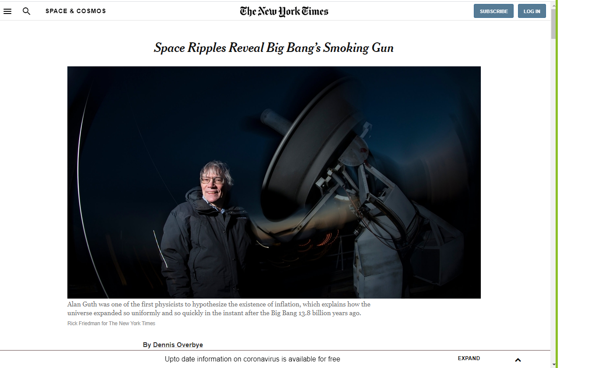

# NY Times Page Clone

This assignment consists of making a clone of a New York Times article page. The goal of this project is to get familiar with:

Embedding images
Working with forms (buttons in this case)
Floats and positioning
The box model
You can find the original project specification at: https://www.theodinproject.com/courses/html5-and-css3/lessons/positioning-and-floating-elements

## Built With

- HTML and CSS

## Live Demo

[Live Demo Link](https://mikethreels.github.io/nytimes-project/)

## Getting Started

To get a local copy up and running follow these simple example steps.

### Usage
- Just open the `index.html` file

## Authors

👤 **Mimi Peshy**

- Github: [@githubhandle](https://github.com/mimipeshy)
- Twitter: [@twitterhandle](https://twitter.com/pygirl254)
- LinkedIn :[@linkedinhandle](https://www.linkedin.com/in/peris-ndanu-405083193) 

👤 **Mike Threels**

- Github: [@githubhandle](https://github.com/mikethreels)
- Twitter: [@twitterhandle](https://twitter.com/MichaelThreels)
- LinkedIn :[@linkedinhandle](https://www.linkedin.com/in/michael-threels-24101991) 

## 🤝 Contributing

Contributions, issues and feature requests are welcome!

Feel free to check the [issues page](issues/).

## Show your support

Give a ⭐️ if you like this project!

## Acknowledgments

- Hat tip to anyone whose code was used
- Inspiration
- etc

## 📝 License

This project is [MIT](lic.url) licensed.
